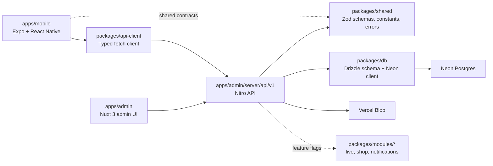

# Architecture

## Overview

This monorepo keeps the admin UI and the API in the same Nuxt 3 application while the Expo mobile app consumes the same `/api/v1` contract through `@douyin/api-client`.

## Application Boundaries

- `apps/admin` owns both the admin UI and the Nitro API.
- `apps/mobile` is a client only. It may call HTTP APIs and use shared packages, but it must not import database code or rely on server secrets.
- `packages/shared` is the source of truth for stable request validation, constants, and error codes.
- `packages/db` contains Drizzle schema and the Neon connection factory.
- `packages/modules/*` hold feature-flagged extension points for future live, shop, and notifications work.

## Request Flow

1. Mobile or admin-facing code calls `/api/v1`.
2. Nitro handlers validate incoming data with Zod schemas from `@douyin/shared`.
3. Server utilities use `useDb()` to access Neon through `@douyin/db`.
4. Upload setup is brokered by the API and media is stored in Vercel Blob.
5. The feed only returns videos whose status is `approved`.

## Vertical Slice

The current MVP is intentionally narrow:

1. Register or log in.
2. Request an upload ticket.
3. Create a video row in `pending`.
4. Approve or reject the video in admin moderation.
5. View approved videos in the feed and interact with likes/comments.

## Extension Rules

- Add new HTTP endpoints under `apps/admin/server/api/v1`.
- Add new shared DTOs and constants in `packages/shared`.
- Keep experimental product areas behind `system_configs.featureFlags`.
- Prefer new product surfaces to start as module packages before they become cross-cutting app code.
