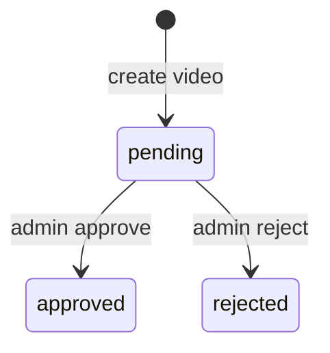

# Database

## Runtime

The MVP uses Neon Postgres with Drizzle ORM. The connection string is provided through `DATABASE_URL`, and all database access is routed through `@douyin/db`.

## Tables

### `users`

- `id`: UUID primary key
- `email`: unique nullable text
- `phone`: unique nullable text
- `password_hash`: hashed password
- `display_name`: required text
- `avatar_url`: nullable text
- `role`: `user | admin`
- `status`: `active | disabled`
- `created_at`, `updated_at`

### `refresh_tokens`

- `id`: UUID primary key
- `user_id`: foreign key to `users`
- `token_hash`: hashed refresh token value
- `expires_at`
- `revoked_at`: nullable timestamp
- `created_at`

### `videos`

- `id`: UUID primary key
- `author_id`: foreign key to `users`
- `title`
- `description`
- `blob_url`
- `cover_url`: nullable text
- `duration_ms`
- `status`: `pending | approved | rejected`
- `view_count`
- `created_at`, `updated_at`

### `likes`

- `user_id`
- `video_id`
- `created_at`
- unique composite index on `user_id + video_id`

### `comments`

- `id`: UUID primary key
- `video_id`: foreign key to `videos`
- `user_id`: foreign key to `users`
- `body`
- `parent_id`: nullable self-reference for replies
- `status`: `visible | hidden`
- `created_at`, `updated_at`

### `moderation_logs`

- `id`: UUID primary key
- `video_id`: foreign key to `videos`
- `admin_id`: foreign key to `users`
- `action`: `approve | reject`
- `reason`: nullable text
- `created_at`

### `system_configs`

- `key`: text primary key
- `value`: jsonb payload
- `updated_at`

`featureFlags` is the main seeded config today:

```json
{
  "live": false,
  "shop": false,
  "notifications": false
}
```

## Video Status Machine



Behavior notes:

- New uploads always start as `pending`.
- Only `approved` videos appear in the public feed.
- Rejected videos stay rejected in the current MVP. There is no re-queue workflow yet.

## Seed Data

`pnpm db:seed` upserts:

- the admin user from `SEED_ADMIN_EMAIL` and `SEED_ADMIN_PASSWORD`
- the `featureFlags` row in `system_configs`

## Deferred Schema Work

The codebase reserves module space for live and shop, but those tables are intentionally not implemented in this MVP. Add them only when the feature flags and app surfaces are ready to consume them.
